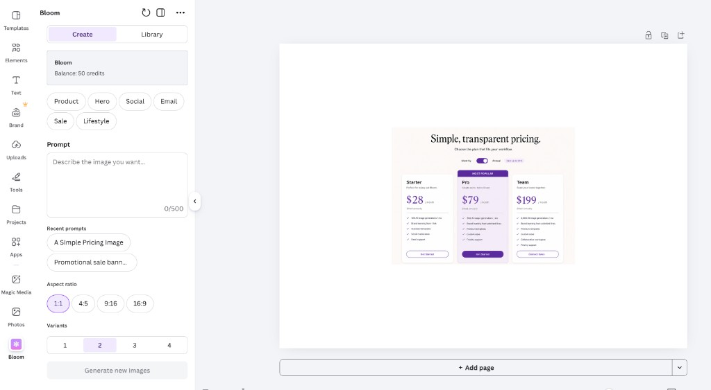

# Bloom for Canva

Generate on-brand images inside Canva using the Bloom API.
Connect your Bloom brand once — then generate, select,
and add images directly to any Canva design.



## Features

- Generate on-brand images from any text prompt
- 6 preset templates for common use cases
- Select aspect ratio: 1:1, 4:5, 9:16, 16:9
- Generate 1-4 variants at once
- Library tab for browsing previously generated images
- Add to design in one click

## How it works

1. Connect your Bloom API key
2. Select your brand
3. Describe what you want to generate
4. Click Generate
5. Select an image and click "Add to design"

## Setup for development

### Prerequisites

- Node.js 18+ (see `package.json` `engines` for the versions this repo is tested with)
- A [Canva Developer](https://www.canva.com/developers/apps) account and an app created in the portal
- A [Bloom API key](https://www.trybloom.ai/developers) (entered inside the app at runtime, not in `.env`)

### Install

```bash
npm install
```

`postinstall` copies `.env.template` → `.env` **only if** `.env` does not exist yet. After the first install you should have a `.env` file in the project root.

### Environment variables

Local tooling (`npm start`, webpack) reads **`.env`** in the repo root. **Do not commit `.env`** (it is listed in `.gitignore`). Share `.env.template` only; each developer keeps their own `.env`.

#### Where to get Canva values

1. Sign in at [canva.com/developers](https://www.canva.com/developers/apps) and open **your app** (create one if needed).
2. Open **Settings** (or **Your app** → app details, depending on the portal layout).
3. Find **Security** / **Credentials** / **App credentials** — Canva exposes values you can copy into `.env`. The exact labels vary; look for:
   - **App ID** → maps to `CANVA_APP_ID`
   - **App origin** or **Development origin** (a URL like `https://app-xxxxxxxxxxxx.canva-apps.com`) → maps to `CANVA_APP_ORIGIN`

If the portal offers **“Download .env”** or a pre-filled env block, you can paste those lines into your local `.env` and merge with the template below.

#### What each variable means

| Variable | Required for dev? | Purpose |
|----------|-------------------|--------|
| `CANVA_FRONTEND_PORT` | **Yes** | Port for the webpack dev server (default `8080`). Your **Development URL** in the portal must use this port, e.g. `http://localhost:8080`. |
| `CANVA_BACKEND_PORT` | **Yes** | Port reserved for an optional Node backend (`backend/server.ts`). This starter expects it to be set even if you only run the frontend; keep default `3001` unless you change the backend. |
| `CANVA_BACKEND_HOST` | **Yes** | Base URL of your backend. For local backend: `http://localhost:3001`. For **frontend-only** apps you can leave this as the template default; webpack may warn if it is still `localhost` when you run a **production** build — change it before shipping a backend. |
| `CANVA_APP_ID` | Optional for basic preview | Your app’s ID from the portal. Needed for backend JWT verification and some advanced flows. |
| `CANVA_APP_ORIGIN` | Required **if** HMR is on | Your app’s origin URL from the portal (e.g. `https://app-….canva-apps.com`). |
| `CANVA_HMR_ENABLED` | No | `TRUE` / `FALSE` (case-insensitive). Hot Module Replacement: faster UI reloads while coding. If `TRUE`, **`CANVA_APP_ORIGIN` must be set** or `npm start` will error. |

#### Example `.env` for local UI work

After `npm install`, edit `.env` so it looks like this (replace placeholders with your portal values):

```bash
CANVA_FRONTEND_PORT=8080
CANVA_BACKEND_PORT=3001
CANVA_BACKEND_HOST=http://localhost:3001
CANVA_APP_ID=your_app_id_here
CANVA_APP_ORIGIN=https://app-xxxxxxxxxxxx.canva-apps.com
CANVA_HMR_ENABLED=FALSE
```

- For **first-time preview** without HMR, you can leave `CANVA_APP_ID` / `CANVA_APP_ORIGIN` as in `.env.template` (empty or commented per template) **only if** you keep `CANVA_HMR_ENABLED=FALSE`. If you enable HMR, set `CANVA_APP_ORIGIN` to the value from the portal.
- If `npm start` fails with **“CANVA_APP_ORIGIN is not set”**, either set the origin from the portal or set `CANVA_HMR_ENABLED=FALSE`.

#### HTTPS and Safari

By default the dev server uses **HTTP**. Chrome/Firefox allow `http://localhost` from Canva’s HTTPS editor; **Safari** often blocks mixed content. To use HTTPS locally:

```bash
npm start -- --use-https
```

Then use `https://localhost:8080` (or your chosen port) as the **Development URL** in the portal and accept the local certificate warning when prompted.

### Run locally

```bash
npm start
```

With the default template, the app is served at **http://localhost:8080** (or `CANVA_FRONTEND_PORT`). Use the same scheme and port in the Developer Portal **Development URL**.

Optional flags:

- `npm start -- -p 9090` — override the frontend port for this run.
- `npm start -- --preview` — start and open preview (when configured).

### Load in Canva

1. Go to [canva.com/developers](https://www.canva.com/developers/apps) and open your app.
2. Set **Development URL** to match your dev server (e.g. `http://localhost:8080` or `https://localhost:8080` if using HTTPS).
3. Click **Preview** and open the app from the editor side panel.

## Project structure

| Path | Role |
|------|------|
| `src/index.tsx` | Registers the design editor intent with `@canva/intents` |
| `src/intents/design_editor/index.tsx` | React root, App UI Kit / i18n providers, global styles |
| `src/app.tsx` | All app state and view rendering |
| `src/api.ts` | Bloom REST API client |
| `src/utils.ts` | Utilities, constants, prompt templates |
| `src/styles.css` | Component styles |

## Architecture note

Canva apps run as an iframe inside the Canva editor.
All Bloom API calls happen directly from the browser.
Images are fetched, converted to data URLs, uploaded
to Canva's CDN, then inserted into the design.

## Get your Bloom API key

[trybloom.ai/developers](https://www.trybloom.ai/developers)
